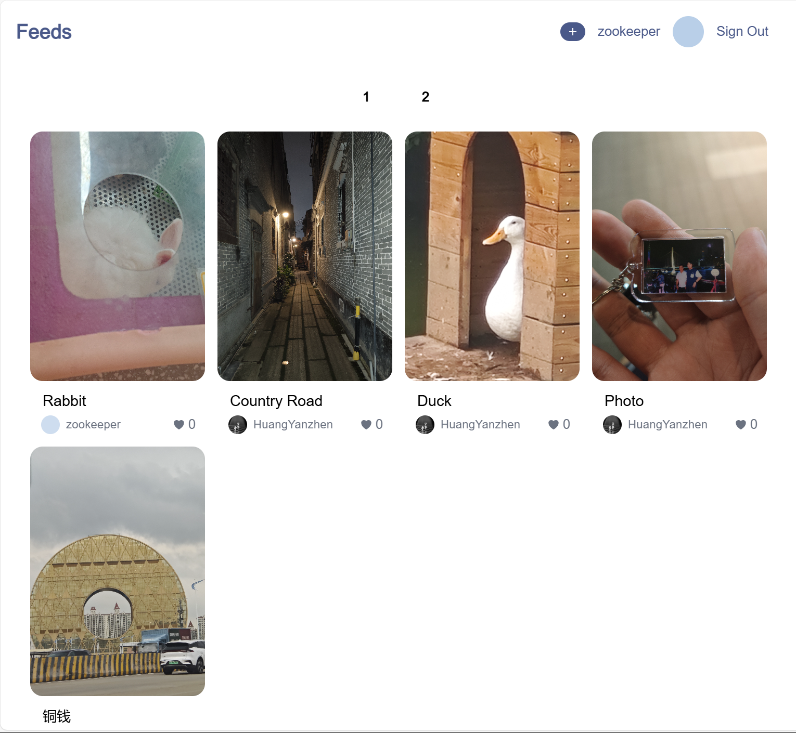
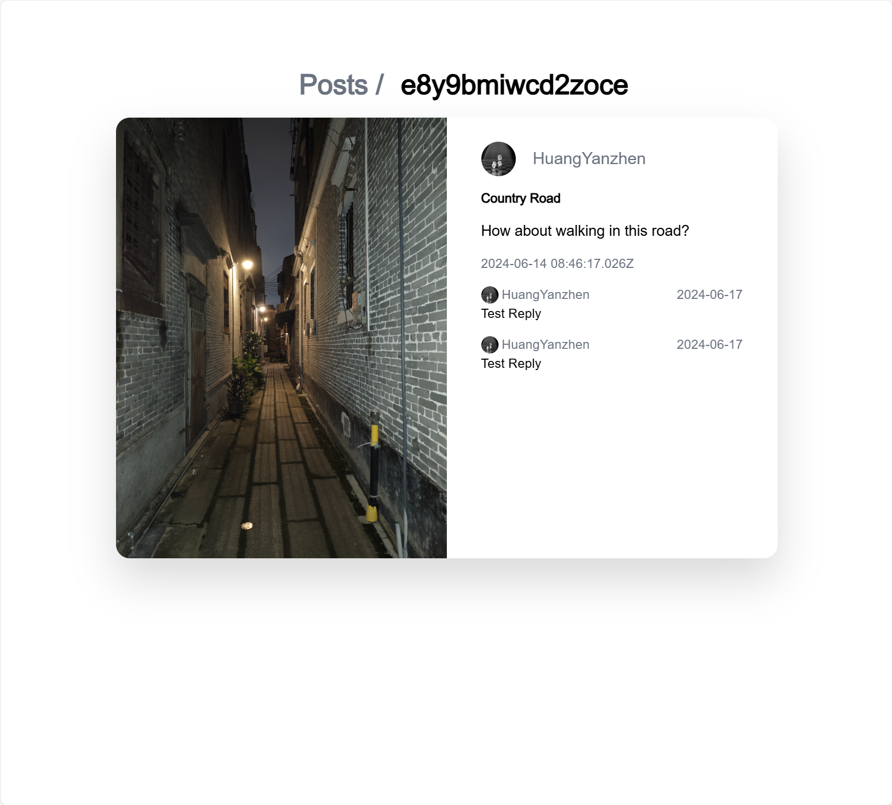
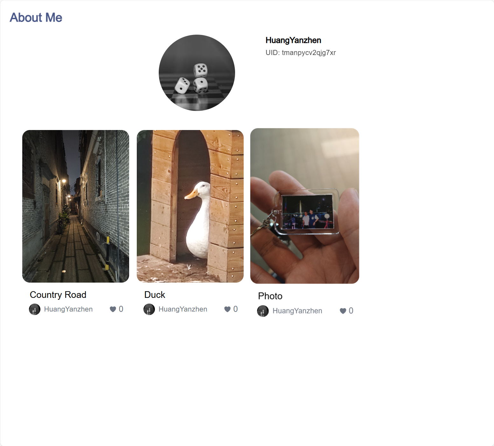
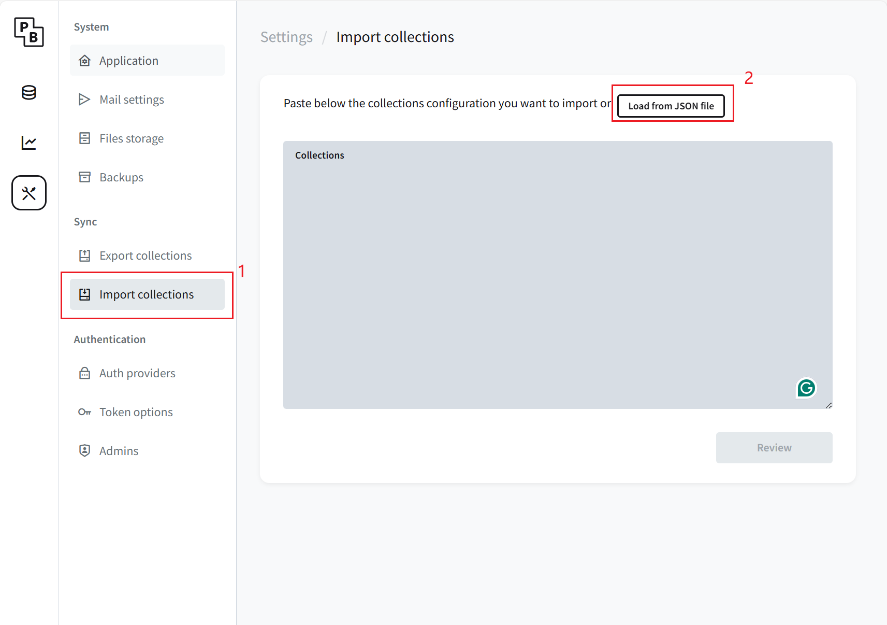

## Project Demo
### Main Feeds Page

### Feed Detail Page

### User Profile Page

## To run this project:
### 1. Configure Database

#### 1.1 Start Pocketbase
&emsp; Start pocketbase by running `./pocketbase serve` in the terminal.
This portable database is only usable on windows. After the database is running, click on the link it provided to access the database admin panel. Register an admin account (local) first before you start over.

#### 1.2 Import Schemas

&emsp; In pocketbase, click on "Import Collections", then click on "Load from JSON file". Select the `pb_schema.json` file in the roo folder of this project.

### 2. Run Development Server
&emsp; Run `npm run dev` in the terminal. It uses `localhost:3000` so make sure this port is in idle.
